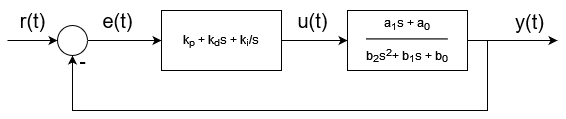

# Tuning PID controller with Genetic Algorithm

## Control loop block diagram

  

## Model
Close loop control system made of PID controller and 2nd order transfer function of linear system's step response is simulated with difference equations derived from billinear transform of linear transfer function of whole system (Tustin method). Coefficients of plant transfer function ($a_{0}, a_{1}, b_{0}, b_{1}, b_{2}$) as well as simulation parameters are set in `constants.hpp` file.

## Adaptation measure
The controller's gains are tuned in order to minimize following cost function:

$$J = \frac{(T_{r} - \hat{T_{r}})^{2} + (O_{s} - \hat{O_{s}})^{2} + (T_{5s} - \hat{T_{5s}})^{2}}{3}$$

where

- $T_{r}$ - Rise time [s]
- $\hat{T_{r}}$ - Required rise time [s]
- $O_{s}$ - Overshoot
- $\hat{O_{s}}$ - Required overshoot
- $T_{5s}$ - 5% settling time [s]
- $\hat{T_{5s}}$ - Required 5% settling time [s]

The given cost function is used as a measure of adaptation for every member of population.

## Genetic algorithm
Gene are coded in multiallelic manner (agent's parameters are stored in vector [$k_{p}$, $k_{d}$, $k_{i}$]). Every iteration of algorithm is made of couple phases: selection, crossing, mutation and replacement. The selection phase conducted with use of adaptation measure is done to eliminate poorly adapted agents from contributing to children pool.(-----------describe selection method----------). In the crossing phase the random pairs are made of part of population selected for crossing (this group's size must be even number) and their children are created by performing arithmetic crossing. After that the mutation phase (equal-value fenotype mutation) is done to introduce random changes in some agents' parameters in order to create more diversity in children population. The last is replacement phase where children are replacing randomly selected agents from previous generation.

### Arithmetic crossing
Parents' parameters:
- $v_{1} = [k_{p1}, k_{d1}, k_{i1}]$
- $v_{2} = [k_{p2}, k_{d2}, k_{i2}]$

Childrens' parameters:
- $v_{1c} = v_{1}a + (1-a)v_{2}$
- $v_{2c} = v_{2}a + (1-a)v_{1}$

where a is a random parameter of crossing from range [0, 1].

### Equal-value fenotype mutation
From a population of size $N$ the $k$ ($k \ge N$) randomly selected agents have their parameters altered. The parameter and it's value are randomly selected as well. The probability of mutation happenning at all as well (0.01 = 1%) as maximum and minimum values for parameters can be selected by passing proper parameters to the `mutation()` method.

### Replacement strategy with partial reproduction
The $k$ children created from selected subpopulation are replacing $k$ randomly chosen agents from previous population. The new population is made of children of best agents and random agents from previous population.

## Sample results